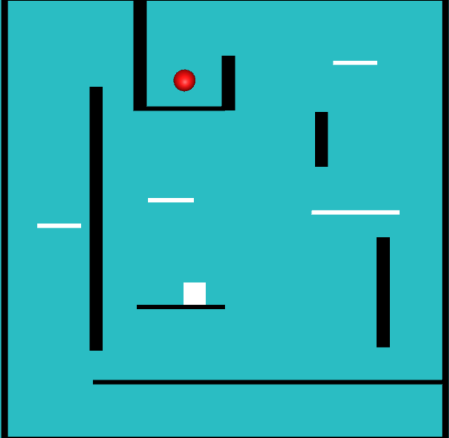

PROJET MANETTE : Clavelin et Suleimanova

Le but de ce projet était de réaliser un Platformer simple (pas de graphismes extraordinaires, l'accent était sur les fonctionnalités) sous Unity3D, sans utiliser le moteur physique de Unity pour les forces et les collisions

**I) Fonctionnalités disponibles :**

*a) Déplacement horizontal :*
- Manette : stick gauche / croix
- Ordinateur : flèches du clavier

*b) Saut*
- Manette : Bouton A
- Ordinateur : touche espace
Le double saut est disponible.

 **II) Obstacles:**

 *a) Plateforme traversable:0*

Ces plateformes sont traversable de bas en haut. Le joueur ne peut pas les traverser dans le sens inverse.

*b) Plateforme non traversable :*

Ces plateformes ne peuvent pas être traversées.

*c) Murs:*

Les murs sont des obstacles non traversables. Cependant ces murs permettent d'exécuter un WallJump, en appuyant sur la touche de saut quand le joueur touche un mur. Cette fonctionnalité n’est disponible que lorsque le joueur alterne les murs.  

**III) Valeurs de réglages:**
Les valeurs de réglages se trouvent dans le ScriptVariables.
On peut y régler :
- G ​​: valeur de gravité. Cette valeur influence sur la vitesse de chute du joueur.  La valeur exacte utilisée pour la démonstration est​ 7​​.
- Impulsion.​​ C’est une impulsion donnée au joueur pour exécuter son saut. La valeur exacte utilisée est ​8.
- Boundary​​ contient les éléments dû aux limites du jeu sur les axes x et y.  Les limites en X et Y sont ​-4.7 et 4.7​​ pour les deux axes.  
- MaximumSpeed​​ est une vitesse maximale horizontale du joueur. Ici la valeur est fixée à ​5​​.
- MaximumSaut​​ indique le nombre maximal de saut autorisée par joueur avant de retoucher le sol ou les plateformes.  Ici on utilise les doubles sauts donc le la valeur est fixée à ​2.
